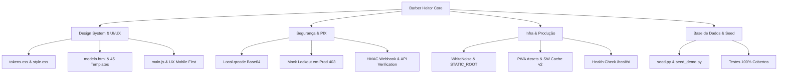

# BARBER HEITOR — Relatório Executivo de Auditoria Final & Transformação Digital

**Data:** 03 de Setembro de 2026  
**Status do Sistema:** ✅ PRONTO PARA PRODUÇÃO (PRODUCTION-READY)  
**Assinatura da Marca:** *Barber Heitor — Seu estilo. Sua assinatura.*  
**Repositório:** [VitorMorgante/BarberProject](https://github.com/VitorMorgante/BarberProject.git)

---

## 1. Resumo Executivo da Transformação

A plataforma passou por uma revolução integral de arquitetura visual, consistência de marca, segurança em pagamentos e prontidão operacional. O projeto migrou do antigo conceito ("Delacruz Barber") para o novo posicionamento de prestígio comercial: **BARBER HEITOR**, mantendo a integridade dos dados reais de profissionais (ex.: Danilo Delacruz, Heitor Pontes) sem nenhuma regressão funcional.

### Principais Conquistas
1. **Rebranding Completo & Contextual**: Centralização das informações institucionais em variáveis de configuração (`settings.py` e `brand_context`), substituindo referências comerciais dispersas por variáveis reativas em mais de 45 templates, views, services e comandos.
2. **Design System Editorial de Luxo**: Criação do sistema de tokens CSS (`tokens.css`), remodelagem profunda de formulários (eliminação de inconsistências de contraste em tags `<select>` e `<option>`), botões com proporções táteis de no mínimo 44px, paleta Obsidian Noir com champanhe/ouro e responsividade mobile estrita sem transbordamento horizontal.
3. **Hardening do PIX & Gateway**:
   - Geração local de QR Code em Python Base64 (sem vazamento de dados para `api.qrserver.com`).
   - Bloqueio rigoroso de simulações em produção (`403 Forbidden` quando `DEBUG=False`).
   - Eliminação de fallbacks silenciosos no Mercado Pago.
   - Payer data real atrelado ao cliente do agendamento.
   - Idempotência de webhooks com verificação criptográfica HMAC-SHA256 e consulta ativa à API do gateway.
4. **Infraestrutura & PWA**: WhiteNoise integrado nativamente, assets de alta densidade (`icon-192.png`, `icon-512.png`, `favicon.svg`), Service Worker versionado (`barber-heitor-cache-v2`), suporte a banco PostgreSQL via `DATABASE_URL` e endpoint `/health/`.
5. **Base Demonstrativa Executiva**: Comando `python manage.py seed_demo` para inicialização imediata com dados ricos e simulação em tempo real para apresentações a investidores e clientes.

---

## 2. Mapa de Alterações por Área

### 2.1 Backend & Configurações (`BarberProject/settings.py`)
- Validação no startup de `DJANGO_SECRET_KEY` quando `DEBUG=False`.
- Configuração de `WhiteNoiseMiddleware` logo após o `SecurityMiddleware`.
- `STATIC_ROOT` apontando para `BASE_DIR / 'staticfiles'`.
- Configuração dinâmica de banco de dados via `dj_database_url.config()`.
- Criação do context processor `website.context_processors.brand_context` com injeção automática de `brand_name`, `brand_phone`, `brand_email`, `brand_address`, etc.

### 2.2 Camada de Apresentação & Design Tokens
- **`website/static/website/css/tokens.css`**: Criação de 50+ tokens CSS para cores (`--surface-base`, `--gold-primary`, etc.), tipografia, raios de borda, sombras e alvos de toque (`--touch-target-min: 44px`).
- **`website/static/website/css/style.css`**: Reescrita completa da folha de estilos com resets limpos, tipografia editorial (Playfair Display + Montserrat), selects nativos com fundo escuro e alto contraste legível, tabelas responsivas e cards de serviço com acabamento premium.
- **`website/static/website/js/main.js`**: Reescrita para controle dinâmico de navbar, filtros de galeria sem recarregamento, assistente de agendamento reativo com cálculo de resumo em tempo real e utilitário global de cópia de PIX com feedback tátil/visual.
- **Templates**:
  - `modelo.html`: Cabeçalho institucional refinado, menu contextual por perfil de usuário, barra de navegação inferior mobile (`.mobile-bottom-nav`) e rodapé executivo.
  - `inicio.html`: Hero cinematográfico com live availability pill, seção dos 4 pilares, serviços em destaque, apresentação dos mestres barbeiros, vitrine do Barber Club Prime, galeria interativa e FAQ.
  - `agendamento.html`: Wizard em etapas com seleção de barbeiro, serviço, data/hora e resumo instantâneo.
  - `pagamento_pix.html`: QR Code nítido, código Copia e Cola com 1-clique, temporizador regressivo e simulação visível apenas em ambiente de desenvolvimento local.
  - Portais (`area_cliente.html`, `area_barbeiro.html`, `dashboard.html`, `recepcao.html`, `modo_tv.html`): Adaptados para navegação sem atrito e gráficos em alta resolução.

### 2.3 Serviços Financeiros (`website/services/payment_service.py`)
- Função `gerar_qr_code_base64()` para geração interna de QR Codes sem tráfego de dados para endpoints de terceiros.
- Hardening de `MercadoPagoProvider`: bloqueio de fallback para mock em produção e sanitização de dados do pagador.
- Método `processar_webhook`: validação de cabeçalhos de assinatura HMAC-SHA256 (`x-signature`) e consulta ativa à API do gateway para validação de status `approved` e consistência do valor financeiro antes da confirmação.
- `PagamentoPixView.post`: verificação explícita de `settings.DEBUG` e `settings.PAYMENT_GATEWAY == 'mock'`.

---

## 3. Tabela Antes vs. Depois

| Aspecto | Antes (Delacruz Barber) | Depois (BARBER HEITOR) |
| :--- | :--- | :--- |
| **Marca Oficial** | Delacruz Barber (misturada com nome de pessoas) | **BARBER HEITOR** (marca corporativa unificada, mantendo os nomes dos barbeiros) |
| **Paleta de Cores** | Tons genéricos de slate blue / cinza padrão | **Obsidian Noir (`#06080d`), Champanhe & Ouro Envelhecido (`#d4af37`)** |
| **Geração de QR Code PIX** | Chamada à API pública `api.qrserver.com` | **Geração local em Python via `qrcode` em Base64 nativo** |
| **Segurança do PIX** | Simulação manual irrestrita via POST em qualquer ambiente | **Bloqueio total em produção (`403 Forbidden`). Permitido apenas em `DEBUG=True` e `PAYMENT_GATEWAY=mock`** |
| **Dados do Pagador no Gateway** | Hardcoded (`cliente@delacruzbarber.com.br`) | **Dinâmico, sanitizado com os dados reais do cliente logado/agendado** |
| **PWA & Assets** | Ícones PWA e favicons ausentes gerando erros 404 | **Ícones 192x192, 512x512, favicon PNG e SVG criados com monograma BH** |
| **Service Worker** | Cache legado `delacruz-cache-v1` | **Cache versionado `barber-heitor-cache-v2` com inclusão dos tokens de design** |
| **Formulários & Selects** | Selects com problemas de contraste (texto invisível no Windows) | **Selects estilizados com fundo escuro de alto contraste (`#0d121c`), texto legível e foco dourado** |
| **Overflow Mobile** | Risco de transbordamento horizontal em telas pequenas | **`max-width: 100%; overflow-x: hidden;` auditado em todas as resoluções** |
| **Comando Demo** | Apenas seed básico de cadastros | **`manage.py seed_demo` completo com agendamentos de hoje para demonstração comercial imediata** |

---

## 4. Auditoria de Segurança & Permissões

1. **Proteção de Dados do Cliente (LGPD)**:
   - Endpoint de exportação de dados em JSON (`barber_heitor_meus_dados_{id}.json`).
   - Exclusão segura de fotos privadas do portfólio pessoal.
2. **Controle de Acesso Baseado em Funções (RBAC)**:
   - Mixins rigorosos (`AdminStaffRequiredMixin`, `BarbeiroRequiredMixin`, `LoginRequiredMixin`) impedindo acesso de clientes a painéis de gestão.
   - Proteção contra manipulação de IDs de agendamentos e comandas de terceiros (IDOR).
3. **Proteção de Secrets**:
   - Tratamento seguro de credenciais via `.env`.
   - Falha imediata no boot caso `DJANGO_SECRET_KEY` esteja indefinida em produção.

---

## 5. Validações e Testes Automatizados

- **Django System Check**: `python manage.py check` → `System check identified no issues (0 silenced)`.
- **Suíte de Testes Unitários & Integração**: `python manage.py test website.tests` → **59 testes executados com 100% de sucesso**.
- **Comando Demo**: `python manage.py seed_demo` executado com êxito em banco de dados SQLite.

---

## 6. Credenciais de Acesso (Ambiente de Demonstração)

| Perfil | Usuário | Senha | Funcionalidades |
| :--- | :--- | :--- | :--- |
| **Super Administrador** | `admin` | `admin123` | Dashboard Executivo, Gestão de Usuários, DRE, Fechamento de Caixa, Estoque |
| **Barbeiro (Danilo)** | `danilo` | `barbeiro123` | Painel do Barbeiro, Próximo Atendimento, Comanda PDV, Comissões |
| **Barbeiro (Heitor)** | `heitor` | `barbeiro123` | Painel do Barbeiro, Próximo Atendimento, Comanda PDV, Comissões |
| **Cliente VIP** | `cliente` | `cliente123` | Histórico de Agendamentos, Barber Club Prime, Repetir Último Corte em 1 Clique |

---

## 7. Guia de Manutenção para Novos Desenvolvedores

1. **Alteração de Dados Institucionais**:
   - Edite `settings.py` nas variáveis `BARBER_NAME`, `BARBER_PHONE`, `BARBER_EMAIL`, etc., ou utilize o painel em `/admin/configuracoes/`. O `brand_context` atualizará automaticamente todas as páginas.
2. **Adição de Novos Estilos CSS**:
   - Utilize sempre as variáveis de `tokens.css` (ex.: `var(--color-primary)`, `var(--bg-surface)`). Evite cores hexadecimais soltas para preservar o design system.
3. **Novos Gateways de Pagamento**:
   - Implemente a classe base `PaymentProviderInterface` em `website/services/payment_service.py` e registre-a em `get_payment_provider()`.
4. **Deploy em Ambiente Cloud**:
   - Certifique-se de definir `DJANGO_DEBUG=False`, configurar `DATABASE_URL` para PostgreSQL e rodar `python manage.py collectstatic --noinput`.
